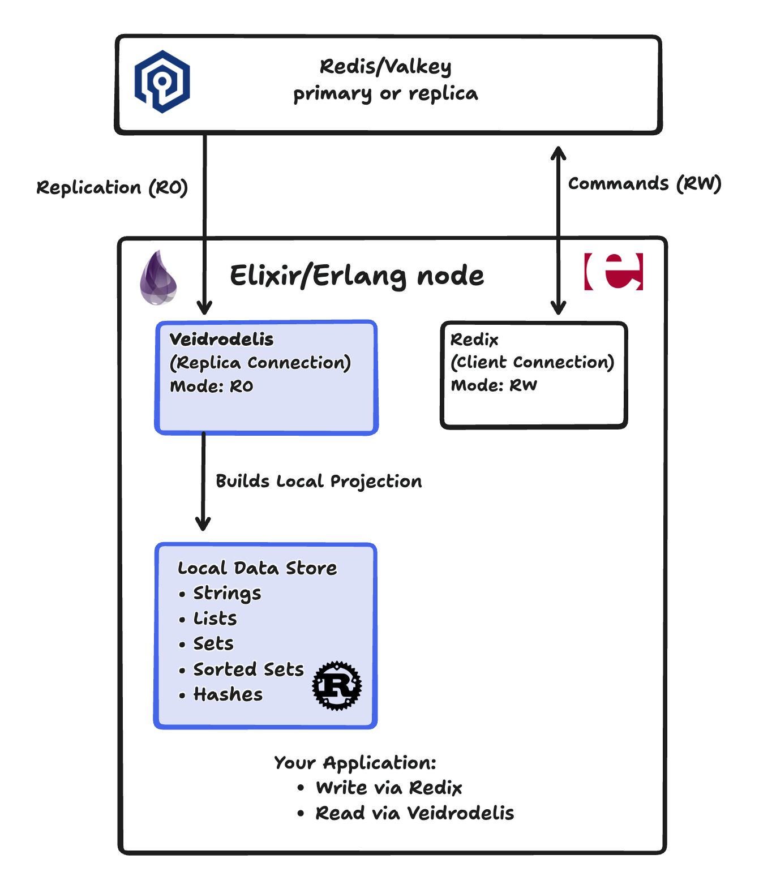

[](https://github.com/savonarola/veidrodelis/actions/workflows/ci.yml)
[](https://hex.pm/packages/veidrodelis)
[](https://hexdocs.pm/veidrodelis/)
[](https://coveralls.io/github/savonarola/veidrodelis?branch=main)


# Veidrodelis

**Local Read-Only Projection of Redis/Valkey Data**

Veidrodelis connects to Redis or Valkey as a replica and builds a local, read-only projection of the data inside your Erlang/Elixir node. Write commands are issued to the remote Redis via a standard client like Redix, while reads are served from the local projection with little latency.

## Architecture



## General Idea

Veidrodelis implements the Redis replication protocol to receive all write operations happening on a Redis/Valkey primary. It builds and maintains a local, in-memory projection of the data using high-performance storage.

**Benefits:**
- **Ultra-low latency reads**: Data is local to your Erlang node, no network round-trip
- **Reduced Redis load**: Read traffic doesn't hit Redis
- **Consistent snapshots**: Atomic read transactions across multiple keys
- **Erlang-native**: Seamless integration with OTP applications

**How it works:**
1. Veidrodelis connects to Redis as a replica (read-only)
2. Redis sends the full dataset (RDB) followed by streaming updates
3. All writes still go through Redis via Redix (or any Redis client)
4. Reads are served from the local projection via Veidrodelis

## Installation

Add to your `mix.exs`:

```elixir
def deps do
  [
    {:veidrodelis, "~> 0.1.5"},
    # optional, for Sentinel support
    # however, you probably need some client to make writes to the primary
    {:redix, "~> 1.5"}
  ]
end
```

## Usage

### Simple Case: Connect and Use

The most basic setup: connect Veidrodelis for reads, Redix for writes.

```elixir
# Start Veidrodelis (replica connection for reads)
{:ok, vdr} = Veidrodelis.start_link(
  id: :my_cache,
  host: "localhost",
  port: 6379
)

# Start Redix (client connection for writes)
{:ok, rdx} = Redix.start_link(
  host: "localhost",
  port: 6379
)

# Write via Redix
Redix.command!(rdx, ["SET", "user:123:name", "Alice"])
Redix.command!(rdx, ["HSET", "user:123:profile", "age", "30", "city", "NYC"])

# Wait a moment for replication
Process.sleep(100)

# Read via Veidrodelis (from local projection)
{:ok, name} = Veidrodelis.get(:my_cache, 0, "user:123:name")
# => {:ok, "Alice"}

{:ok, age} = Veidrodelis.hget(:my_cache, 0, "user:123:profile", "age")
# => {:ok, "30"}

Redix.command!(rdx, ["LPUSH", "events", "login", "purchase", "logout"])
{:ok, events} = Veidrodelis.lrange(:my_cache, 0, "events", 0, -1)
# => {:ok, ["logout", "purchase", "login"]}

# Clean up
Veidrodelis.stop(vdr)
Redix.stop(rdx)
```

### Supported data types

Veidrodelis supports replication of [string](doc/string-write.md), [hash](doc/hash-write.md), [list](doc/list-write.md), [set](doc/set-write.md), [sorted set](doc/sorted-set-write.md) data types and almost all commands over these data types.

#### Unsupported Write Commands

Unsupported write commands are:

- `SORT`
- `RESTORE`

and all the commands that are not related to string, hash, list, set, sorted set data types.

To prevent data inconsistencies, configure Redis ACLs to deny unsupported write commands, see [doc/acl.txt](doc/acl.txt) for the recommended configuration.

#### Replication caveats

Some write commands (namely, `ZREMRANGEBYLEX`) are declared to produce undefined behavior if applied to wrong data. Obviously, we cannot replicate undefined behavior (in Redis/Valkey the correctness of replication is achieved by running exactly the same code on the replica). So, one should either manually control the
correctness of the data when using these commands or just disable them with renaming or ACLs.

### Read Operations

**String:** `get`

**List:** `llen`, `lrange`

**Set:** `smembers`, `scard`, `sismember`, `smismember`, `srandmember`, `sunion`, `sinter`, `sdiff`, `sintercard`, `sfirst`, `slast`, `snext`, `sprev`

**Hash:** `hget`, `hmget`, `hgetall`, `hkeys`, `hvals`, `hlen`, `hexists`, `hstrlen`, `hrandfield`, `hfirst`, `hlast`, `hnext`, `hprev`

**Sorted Set:** `zscore`, `zcard`, `zrange`, `zrangebyscore`, `zrank`, `zrevrank`, `zcount`, `zfirst`, `zlast`, `znext`, `zprev`

Note, that read operations do not always directly reflect Redis/Valkey commands.

### Transactions

Redis/Valkey supports simple write transactions via the `MULTI` and `EXEC` commands. Also, Redis/Valkey supports Lua scripts for more complex atomic write operations. However, replicas receive plain stream of mutating commands, so when reading from a replica, you may see partial transaction state.

Veidrodelis, being an in-process replica, supports a convention to avoid seeing partial transaction state.

When issuing a write transaction, one sets an arbitrary value to the special key `__vdr_tx` as the first command.
The key is removed as the last command of the transaction.

Then, when replicating, Veidrodelis buffers all the commands between the `SET __vdr_tx` and `DEL __vdr_tx` commands
and applies them atomically.

So Veidrodelis local readers never see partial transaction state.

```elixir
# Start transaction by setting the __vdr_tx key with expiration
# The expiration is recommended - it garantees the end of the transaction
# If you e.g. forget to delete __vdr_tx, it will auto-close when it expires
Redix.pipeline!(rdx,[
  ["MULTI"],
  ["SETEX", "__vdr_tx", "5", "in_progress"],
  ["SET", "account:123:balance", "1000"],
  ["SET", "account:456:balance", "2000"],
  ["SET", "transfer:789:amount", "100"],
  ["DEL", "__vdr_tx"],
  ["EXEC"]
])
```

**Important:** Always set an expiration on `__vdr_tx` (using `SETEX` or `PSETEX`)

### Read Transactions via Command Lists

Execute multiple read operations atomically under a single lock:

```elixir
# Atomic read of multiple keys
{:ok, results} = Veidrodelis.read_tx(:my_cache, 0, [
  {:get, "user:123:name"},
  {:hget, "user:123:profile", "age"},
  {:llen, "user:123:events"},
  {:zcard, "user:123:scores"}
])

# Results is a list of individual command results
[{:ok, "Alice"}, {:ok, "30"}, {:ok, 5}, {:ok, 10}] = results

# More complex example: reading cart and inventory
{:ok, results} = Veidrodelis.read_tx(:my_cache, 0, [
  {:hgetall, "cart:session123"},
  {:get, "inventory:item456:stock"},
  {:zscore, "product:prices", "item456"}
])

# All reads are atomic - they see a consistent snapshot
```

The operations supported by the `read_tx/3` function are the same as the direct read operations supported by the `Veidrodelis` module.

### Read Transactions via Lua

For more complex read logic, use Lua scripts with atomic execution:

```elixir
# Simple Lua script
script = """
local name = ts.get('user:123:name')
local age = ts.hget('user:123:profile', 'age')
return {name, age}
"""

{:ok, ["Alice", "30"]} = Veidrodelis.read_tx(:my_cache, 0, script)

# More complex: key indirection
# Impossible to do with list-based transactions
script = """
local owner_id = ts.get('item:456')
return ts.hget('user:' .. owner_id, 'name')
"""

{:ok, owner_name} = Veidrodelis.read_tx(:my_cache, 0, script)

# Iterate over sorted set
script = """
local results = {}
local first_score, first_member = ts.zfirst('leaderboard')
if first_score then
  table.insert(results, {first_member, first_score})

  local next_score, next_member = ts.znext('leaderboard', first_score, first_member)
  while next_score do
    table.insert(results, {next_member, next_score})
    next_score, next_member = ts.znext('leaderboard', next_score, next_member)
  end
end
return results
"""

{:ok, leaderboard} = Veidrodelis.read_tx(:my_cache, 0, script)
```

The operations supported in read Lua scripts are the same as the direct read operations supported by the `Veidrodelis` module.

**Performance tip:** Compile scripts once, reuse many times:

```elixir
# Compile script to bytecode
script = "return ts.get('user:123:name')"
{:ok, bytecode} = Veidrodelis.lua_load(:my_cache, script)

# Reuse bytecode for faster execution
{:ok, result1} = Veidrodelis.read_tx(:my_cache, 0, bytecode)
{:ok, result2} = Veidrodelis.read_tx(:my_cache, 0, bytecode)
```

### Key Watches

Subscribe to real-time notifications when specific keys are modified. Watchers receive messages for every write operation affecting the watched key. The watches may produce false positives, so the key's value may appear to be not modified even if a notification was issued.

```elixir
# Subscribe to key updates
:ok = Veidrodelis.watch(:my_cache, 0, "user:123:name", :my_watch_ref)

# Perform writes via Redix
Redix.command!(rdx, ["SET", "user:123:name", "Alice"])

# Receive notifications in your process
receive do
  {:my_watch_ref, %Vdr.WatchEvent.Update{command: cmd, db: db}} ->
    IO.inspect({:key_updated, cmd, db})
    # => {:key_updated, [...], 0}
end

# Unsubscribe when done
:ok = Veidrodelis.unwatch(:my_cache, 0, "user:123:name")
```

**Event types:**

- **Update event**: `{ref, %Vdr.WatchEvent.Update{command: cmd, db: db}}`
  Sent when the watched key is modified. Contains the full command that modified it.

- **Init event**: `{ref, %Vdr.WatchEvent.Init{}}`
  Sent when Veidrodelis (re)connected and finished building the initial projection of the data.

**Important notes:**

- Each process can watch the same key only once
- Watches survive reconnections (automatically re-registered)
- Watches are cleaned up when the watching process terminates
- The `command` field contains the full Redis command as a list (e.g., `["SET", "key", "value"]`)

### Reconnection and Projection Caching

Veidrodelis handles Redis disconnections gracefully with automatic reconnection and intelligent projection caching.

**How it works:**

1. **Disconnection Detected**: Network failure or Redis restart
2. **Old Projection Cached**: The current local projection remains available for reads
3. **Reconnection Initiated**: Automatic reconnection with exponential backoff
4. **New Projection Built**: Full RDB transfer + streaming updates to a new storage
5. **Atomic Switch**: Once streaming starts, old projection is replaced with new one
6. **Reads Never Block**: During the entire process, reads continue from the cached projection

```elixir
# Start Veidrodelis with reconnection enabled (default)
{:ok, vdr} = Veidrodelis.start_link(
  id: :my_cache,
  host: "localhost",
  port: 6379,
  reconnect: true,
  reconnect_delay_ms: 1000,          # Initial delay: 1 second
  max_reconnect_delay_ms: 30_000     # Max delay: 30 seconds
)

# Reads work normally
{:ok, value} = Veidrodelis.get(:my_cache, 0, "mykey")

# >>> Redis goes down <<<
# Veidrodelis detects disconnection, keeps serving reads from cached projection

{:ok, value} = Veidrodelis.get(:my_cache, 0, "mykey")
# Still works! Uses cached projection

# >>> Redis comes back up <<<
# Veidrodelis automatically reconnects, starts building new projection
# Meanwhile, reads still served from cached projection

# >>> New projection ready <<<
# Atomic switch: new projection replaces old one
# Application sees no downtime

{:ok, new_value} = Veidrodelis.get(:my_cache, 0, "mykey")
# Now reading from fresh, up-to-date projection
```

**Reconnection behavior:**

- **Exponential backoff**: Starts at `reconnect_delay_ms`, doubles on each failure, up to `max_reconnect_delay_ms`
- **Infinite retries**: Veidrodelis keeps trying until Redis is available
- **No read disruption**: Old projection serves reads during entire reconnection process
- **Atomic updates**: New projection is complete before switching

**Monitoring replication state:**

```elixir
state = Veidrodelis.get_replication_state(:my_cache)
# Possible states: :init, :ping, :auth, :replconf_listening_port, :replconf_capa, :psync, :rdb_transfer, :streaming
```

### Expiration

Veidrodelis ignores all expirations of keys/hash keys, because they are only needed if a replica becomes a primary, which is obviously not the case for Veidrodelis. Primary server explicitly issues del/hdel commands for expired keys, and they are replicated.

On disconnect, Veidrodelis does not receive these explicit del/hdel commands, so it looks like the time "froze" for the cached projection.

### Sentinel Support

For high-availability setups, connect via Redis Sentinel:

```elixir
{:ok, vdr} = Veidrodelis.start_link(
  id: :my_cache,
  sentinel: [
    sentinels: [
      [host: "sentinel1.example.com", port: 26379],
      [host: "sentinel2.example.com", port: 26379],
      [host: "sentinel3.example.com", port: 26379]
    ],
    group: "myprimary",
    role: :primary,
    timeout: 1000
  ],
  username: "my_user",  # Optional: ACL username
  password: "secret"    # Optional: auth password
)

```
Veidrodelis automatically:
* Discovers primary via Sentinel
* Handles failover when primary changes
* Reconnects to new primary seamlessly
* Maintains read availability during failover

## Project name

The project name is a diacritic-less form of the Lithuanian word "veidrodėlis", meaning "a small/pocket mirror."

## License

[Apache 2.0](LICENSE)
