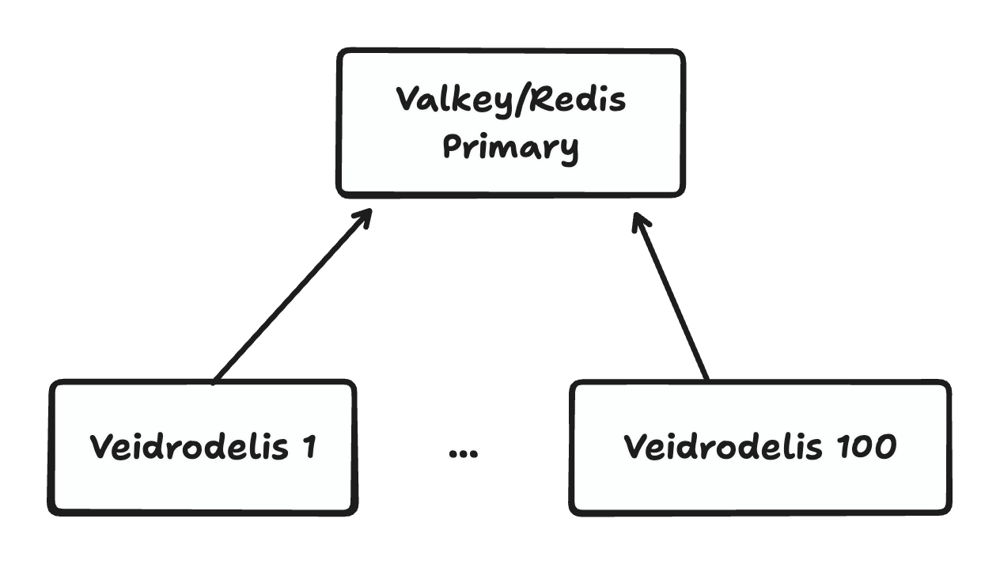
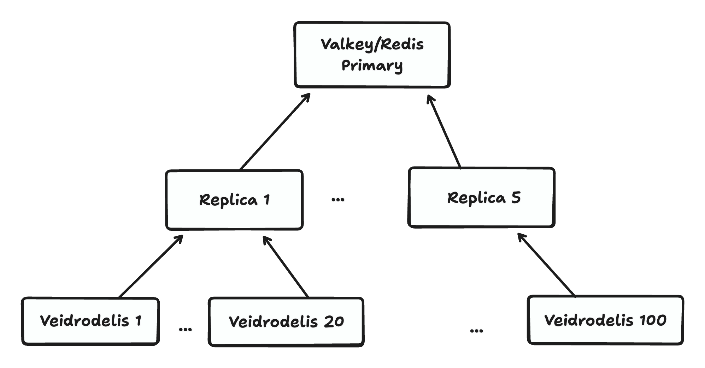

[](https://github.com/savonarola/veidrodelis/actions/workflows/ci.yml)
[](https://hex.pm/packages/veidrodelis)
[](https://hexdocs.pm/veidrodelis/)
[
](https://coveralls.io/github/savonarola/veidrodelis?branch=main)


# Veidrodelis

**Local Read-Only Projection of Valkey/Redis Data**

Veidrodelis connects to Valkey or Redis as a replica and builds a local, read-only projection of the data inside your Erlang/Elixir node.

This allows to implement patterns with frequent reads and less frequent writes efficiently. Write commands are issued to the remote Valkey/Redis instance via a standard client like Redix, while reads are served from the local projection with little latency.

## Architecture


## General Idea

Veidrodelis implements the Redis replication protocol to receive all write operations happening on a Valkey/Redis instance. It builds and maintains a local, in-memory projection of the data using high-performance NIF-based storage.

1. Veidrodelis connects to Valkey/Redis as a replica.
2. Valkey/Redis sends the full dataset (RDB) snapshot to the replica, which is parsed and stored into the local projection.
3. Valkey/Redis sends the streaming updates to the replica, which are parsed and applied to the local projection in real-time.
4. In-process clients can read the data from the local projection with little latency.

## Installation

Add to your `mix.exs`:

```elixir
def deps do
  [
    {:veidrodelis, "~> 0.1.5"},
    # Optional, for Sentinel support.
    # Also, some regular Valkey/Redis client is needed if writes are needed.
    {:redix, "~> 1.5"}
  ]
end
```

## Usage

### Simple example

The most basic setup: connect Veidrodelis for reads, Redix for writes.

```elixir
# Start Veidrodelis for reads
{:ok, vdr} = Veidrodelis.start_link(
  id: :my_vdr_id,
  host: "localhost",
  port: 6379
)

# Start Redix for writes
{:ok, rdx} = Redix.start_link(
  host: "localhost",
  port: 6379
)

# Write via Redix
Redix.command!(rdx, ["SET", "user:123:name", "Alice"])
Redix.command!(rdx, ["HSET", "user:123:profile", "age", "30", "city", "NYC"])

# Wait a moment for replication
Process.sleep(100)

# Read via Veidrodelis (from local projection)
{:ok, name} = Veidrodelis.get(:my_vdr_id, 0, "user:123:name")
# => {:ok, "Alice"}

{:ok, age} = Veidrodelis.hget(:my_vdr_id, 0, "user:123:profile", "age")
# => {:ok, "30"}

Redix.command!(rdx, ["LPUSH", "events", "login", "purchase", "logout"])
{:ok, events} = Veidrodelis.lrange(:my_vdr_id, 0, "events", 0, -1)
# => {:ok, ["logout", "purchase", "login"]}

# Clean up
Veidrodelis.stop(vdr)
Redix.stop(rdx)
```

> [!TIP]
> We use `sleep` for simplicity in this example. You may use watches to wait for the data to be replicated.
> See documentation for more details: https://hexdocs.pm/veidrodelis/about.html#7-watches-for-sync-writes

### Supported data types

Veidrodelis supports replication of [string](doc/string-write.md), [hash](doc/hash-write.md), [list](doc/list-write.md), [set](doc/set-write.md), [sorted set](doc/sorted-set-write.md) data types and almost all commands over these data types.

#### Unsupported Write Commands

Unsupported write commands are:

- `SORT`
- `RESTORE`

and all the commands that are not related to string, hash, list, set, sorted set data types.

> [!TIP]
> To prevent unexpected behavior, it is recommended to configure Valkey/Redis ACLs to deny unsupported write commands.
> See [doc/acl.txt](doc/acl.txt) for sample ACL configuration. Another option is to rename the unsupported commands to some obscure names to avoid them being used by accident.


> [!WARNING]
> Some write commands (namely, `ZREMRANGEBYLEX`) are declared to produce undefined behavior if applied to wrong data.
> Obviously, we cannot replicate undefined behavior (in Valkey/Redis the correctness of replication is achieved by running exactly the same code on the replica).
> So, one should either manually control the correctness of the data when using these commands or just disable them with renaming or ACLs.

### Read Operations

The following read operations are supported on the local projection:

**String:** `get`

**List:** `llen`, `lrange`

**Set:** `smembers`, `scard`, `sismember`, `smismember`, `srandmember`, `sunion`, `sinter`, `sdiff`, `sintercard`, `sfirst`, `slast`, `snext`, `sprev`

**Hash:** `hget`, `hmget`, `hgetall`, `hkeys`, `hvals`, `hlen`, `hexists`, `hstrlen`, `hrandfield`, `hfirst`, `hlast`, `hnext`, `hprev`

**Sorted Set:** `zscore`, `zcard`, `zrange`, `zrangebyscore`, `zrank`, `zrevrank`, `zcount`, `zfirst`, `zlast`, `znext`, `zprev`

> [!NOTE]
> These operations resemble the Valkey/Redis commands for better intuition, but they are not exactly the same. E.g. Xfirst/Xlast/Xnext/Xprev commands do not present in Valkey/Redis.

### Transactions

Valkey/Redis supports simple write transactions (atomic writes of multiple keys) via the `MULTI` and `EXEC` commands. Also, Valkey/Redis supports Lua scripts for more complex atomic write operations. However, replicas receive plain stream of mutating commands. So, when reading from a replica, you may see partial transaction state.

Veidrodelis, being an in-process replica, supports a convention to avoid seeing partial transaction state.

When issuing a write transaction, one may set an arbitrary value to the special key `__vdr_tx` as the first command and remove it as the last command of the transaction.

Then Veidrodelis will treat all the commands between the set and del commands as a single transaction and will apply them atomically.

In this way, Veidrodelis local readers will never see partial transaction state.

```elixir
# Start transaction by setting the __vdr_tx key with expiration
# The expiration is recommended - it garantees the end of the transaction
# If you e.g. forget to delete __vdr_tx, it will auto-close when it expires
Redix.pipeline!(rdx,[
  ["MULTI"],
  ["SET", "__vdr_tx", "in_progress"],
  ["SET", "account:123:balance", "1000"],
  ["SET", "account:456:balance", "2000"],
  ["SET", "transfer:789:amount", "100"],
  ["DEL", "__vdr_tx"],
  ["EXEC"]
])
```

### Read Transactions

Simple read transactions (atomic reads of multiple keys) may be performed using the `read_tx/3` function.

```elixir
# Atomic read of multiple keys
{:ok, results} = Veidrodelis.read_tx(:my_vdr_id, 0, [
  {:get, "user:123:name"},
  {:hget, "user:123:profile", "age"},
  {:llen, "user:123:events"},
  {:zcard, "user:123:scores"}
])

# Results is a list of individual command results
[{:ok, "Alice"}, {:ok, "30"}, {:ok, 5}, {:ok, 10}] = results
```

The operations supported by the `read_tx/3` function are the same as the direct read operations supported by the `Veidrodelis` module. `Veidrodelis.hget("hash", "field")` corresponds to `{:hget, "hash", "field"}` and so on.

### Read Transactions via Lua

For more complex read logic, use Lua scripts with atomic execution:

```elixir
# Simple Lua script
script = """
local name = ts.get('user:123:name')
local age = ts.hget('user:123:profile', 'age')
return {name, age}
"""

{:ok, ["Alice", "30"]} = Veidrodelis.read_tx(:my_vdr_id, 0, script)

# More complex: key indirection
# Impossible to do with list-based transactions
script = """
local owner_id = ts.get('item:456')
return ts.hget('user:' .. owner_id, 'name')
"""

{:ok, owner_name} = Veidrodelis.read_tx(:my_vdr_id, 0, script)
```

> [!NOTE]
> Transactions via Lua scripts are needed only if data schema has some kind of key indirection, i.e. we read keys that are
> derived from previously read values.

Example of iteration over a sorted set:

```elixir
script = """
local timeline = {}
local batch_size = 10
local batch = ts.zfirst('leaderboard', batch_size)

while #batch > 0 do
  for i = 1, #batch do
    local item = batch[i]
    local score = item[1]
    local member = item[2]
    table.insert(timeline, {member, score})
  end

  local last_member = batch[#batch][2]
  batch = ts.znext('leaderboard', last_member, batch_size)
end
return timeline
"""

{:ok, leaderboard} = Veidrodelis.read_tx(:my_vdr_id, 0, script)
```

> [!NOTE]
> Ssimple collecting all members is mostly useless, since using zrange is much more efficient.
> Using Xfirst/Xlast/Xnext/Xprev is needed only if iteration requires some additional logic.

The operations supported in read Lua scripts are the same as the direct read operations supported by the `Veidrodelis` module. `Veidrodelis.hget("hash", "field")` corresponds to Lua's `ts.hget('hash', 'field')` and so on.

To improve performance, scripts can be compiled to bytecode once and reused many times:

```elixir
# Compile script to bytecode
script = "return ts.get('user:123:name')"
{:ok, bytecode} = Veidrodelis.lua_load(:my_vdr_id, script)

# Reuse bytecode for faster execution
{:ok, result1} = Veidrodelis.read_tx(:my_vdr_id, 0, bytecode)
{:ok, result2} = Veidrodelis.read_tx(:my_vdr_id, 0, bytecode)
```

### Key Watches

Reading replicated data is only one part of the story. We also frequently need to know when to make the reads, i.e. when the data is modified.

Using watches, one may subscribe to real-time notifications for specific keys and receive messages when the keys are modified.

> [!NOTE]
>The watches may produce false positives, so the key's value may appear to be not modified even if a notification was issued.

```elixir
# Subscribe to key updates
:ok = Veidrodelis.watch(:my_vdr_id, 0, "user:123:name", :my_watch_ref)

# Perform writes via Redix
Redix.command!(rdx, ["SET", "user:123:name", "Alice"])

# Receive notifications in your process
receive do
  {:my_watch_ref, %Vdr.WatchEvent.Update{command: cmd, db: db}} ->
    IO.inspect({:key_updated, cmd, db})
    # => {:key_updated, [...], 0}
end

# Unsubscribe when done
:ok = Veidrodelis.unwatch(:my_vdr_id, 0, "user:123:name")
```

The watches produce two types of events:

- Update event: `{ref, %Vdr.WatchEvent.Update{command: cmd, db: db}}`
  Sent when the watched key was modified during normal replication.
- Init event: `{ref, %Vdr.WatchEvent.Init{}}`
  Sent when Veidrodelis (re)connected and finished initialization of the local projection, i.e. reading the RDB snapshot.

Watches have the following properties:
- Each process can watch the same key only once.
- Watches survive reconnections (automatically re-registered).
- Watches are cleaned up when the watching process terminates.
- The `command` field for `%Update{}` event contains the raw Valkey/Redis command (e.g., `["SET", "key", "value"]`) that modified the key.

### Reconnection and Projection Caching

Veidrodelis handles disconnections from Valkey/Redis gracefully with automatic reconnection and intelligent projection caching.

When Veidrodelis detects a disconnection from Valkey/Redis, it does not became unavailable. Instead, it continues to serve reads using the latest data before the disconnection. When the reconnection is successful, Veidrodelis starts building a new projection, still serving reads from the old one. When the new projection is ready, Veidrodelis atomically switches to the new projection, replacing the old one.

```elixir
# Start Veidrodelis with reconnection enabled (default)
{:ok, vdr} = Veidrodelis.start_link(
  id: :my_vdr_id,
  host: "localhost",
  port: 6379,
  reconnect: true,
  reconnect_delay_ms: 1000,          # Initial delay: 1 second
  max_reconnect_delay_ms: 30_000     # Max delay: 30 seconds
)

# Reads work normally
{:ok, value} = Veidrodelis.get(:my_vdr_id, 0, "mykey")

# >>> Valkey/Redis goes down <<<
# Veidrodelis detects disconnection, keeps serving reads from cached projection

{:ok, value} = Veidrodelis.get(:my_vdr_id, 0, "mykey")
# Still works! Uses cached projection

# >>> Valkey/Redis comes back up <<<
# Veidrodelis automatically reconnects, starts building new projection
# Meanwhile, reads still served from cached projection

# >>> New projection ready <<<
# Atomic switch: new projection replaces old one
# Application sees no downtime

{:ok, new_value} = Veidrodelis.get(:my_vdr_id, 0, "mykey")
# Now reading from fresh, up-to-date projection
```

To know out the current replication state, one may use the `get_replication_state/1` function.

```elixir
state = Veidrodelis.get_replication_state(:vdr_id)
```

Possible states are: `:init`, `:ping`, `:auth`, `:replconf_listening_port`, `:replconf_capa`, `:psync`, `:rdb_transfer` (transient initial states) and `:streaming` final state when the projection is fully built and the replication is in progress.

### Handling Expirations

Veidrodelis ignores all expirations of keys/hash keys, because they are only needed if a replica becomes a primary, which is obviously not the case for Veidrodelis. By Valkey/Redis design, the primary server explicitly issues del/hdel commands for expired keys to replicas, and Veidrodelis relies on them also.

On disconnect, Veidrodelis stops receiving these explicit del/hdel commands, so while being disconnected it looks like the time "froze" for the cached projection.

### Sentinel Support

To improve availability of data stored in Valkey/Redis, often Sentinels are used to monitor the primary and replica servers and promote a replica to a primary in case of failures.

Veidrodelis supports Sentinel-based setups and may discover a server for connection through Sentinels.

```elixir
{:ok, vdr} = Veidrodelis.start_link(
  id: :my_vdr_id,
  sentinel: [
    sentinels: [
      [host: "sentinel1.example.com", port: 26379],
      [host: "sentinel2.example.com", port: 26379],
      [host: "sentinel3.example.com", port: 26379]
    ],
    group: "myprimary",
    role: :primary,
    timeout: 1000
  ],
  username: "my_user",
  password: "secret"
)

```

You may choose to connect to the current primary or to a replica.

Forcing connecting to a replica is useful when there are many Veidrodelis instances and we want to reduce the load on the primary. Instead of having all the instances connected to the primary, we may have a few Valkey/Redis replicas connected to the primary instead, and few Veidrodelisinstances connected to each replica.

Connecting to the primary:



Connecting to the replicas:



## Project name

The project name is a diacritic-less form of the Lithuanian word "veidrodėlis", meaning "a small/pocket mirror."

## License

[Apache 2.0](LICENSE)
